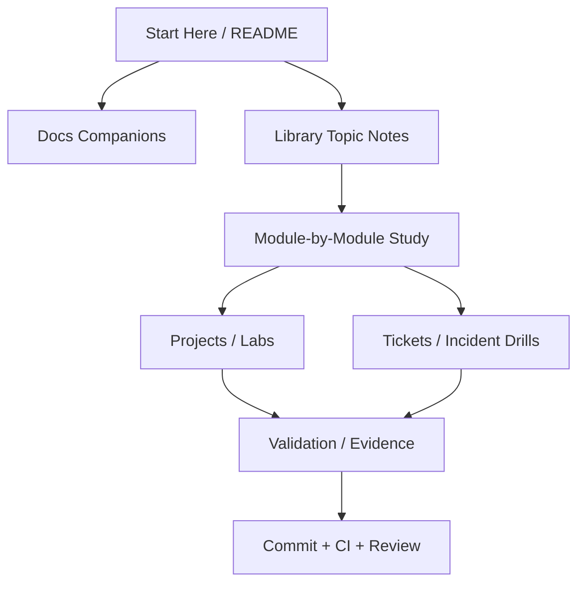
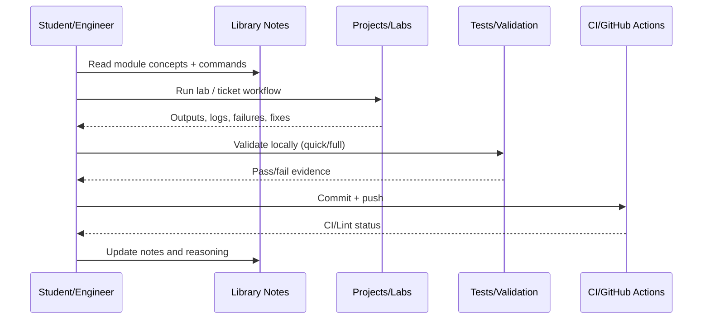
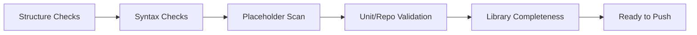

# AI-Assisted Software Engineering Foundation Full Course Master Guide (Single-File)

Author: Simon Parris + Codex consolidation pass
Date: 2026-02-24
Format: One-file course notes guide (Markdown) with diagrams and source map

This file consolidates the course notes into one markdown guide for offline/mobile review.
It preserves the modular `Library/*.md` files while providing a single-file study and revision path.

## What This Guide Includes

- Course map and study flow diagrams
- Quality/verification checklist aligned to repo CI and validation scripts
- Source map for `Library/`, `docs/`, `projects/`, and `tickets/`
- Combined notes from the `Library/` topic files in one place

## Course Architecture Diagram

## Learning Loop Diagram

## Quality Gate Diagram

## Source Map

### Library Files Included in This Guide

- `Library/00_full_course_q_and_a_sheet.md`
- `Library/00_full_lesson_and_ticket_demo_sheet.md`
- `Library/01_ai_foundations_and_llm_basics.md`
- `Library/02_prompt_software_engineering_fundamentals.md`
- `Library/03_context_engineering_and_repository_aware_workflows.md`
- `Library/04_ai_assisted_coding_patterns.md`
- `Library/05_verification_testing_and_trust.md`
- `Library/06_prompt_debugging_and_failure_analysis.md`
- `Library/07_agent_engineering_and_orchestration.md`
- `Library/08_tool_use_permissions_and_guardrails.md`
- `Library/09_rag_and_knowledge_systems_for_coding_assistants.md`
- `Library/10_evals_benchmarks_and_prompt_regression.md`
- `Library/11_security_privacy_and_compliance_in_ai_coding.md`
- `Library/12_team_workflows_and_ai_native_sdlc.md`
- `Library/13_building_your_own_agents_and_platforms.md`
- `Library/14_enterprise_adoption_governance_and_career_paths.md`

### Companion Docs (Referenced)

- `docs/CORE_CONCEPTS.md`
- `docs/LESSON_EXECUTION_COMPANION.md`
- `docs/LESSON_RESEARCH_ANALYSIS_COMPANION.md`
- `docs/OFFLINE_INDEX.md`
- `docs/PROJECT_MANUAL.md`
- `docs/PROJECT_RUNBOOKS_DETAILED.md`
- `docs/README.md`
- `docs/REPOSITORY_STATUS_REPORT.md`

### Project and Ticket/Lab Paths (Top-Level Pointers)

- `projects/`
- `tickets/`
- `tests/`

## Combined Library Notes

_The sections below are combined from the modular `Library/*.md` files to create a single-file course guide._

---

## Source File: `Library/00_full_course_q_and_a_sheet.md`

# 00. Full Course Q&A Sheet

## Foundations

Q: Why can an LLM produce convincing but incorrect code?  
A: It predicts likely tokens, not runtime truth. Without verification tools/tests, correctness is not guaranteed.

Q: What usually matters more in coding tasks: prompt wording or context quality?  
A: Context quality and scope control often matter more.

## Prompt Engineering

Q: What are the minimum fields in a good coding prompt?  
A: Task, context, constraints, acceptance criteria, and validation requirements.

Q: Why are acceptance criteria important?  
A: They define observable success and prevent silent behavior changes.

## Agents

Q: What makes an AI assistant an agent?  
A: Tool use, state, iterative action, and policies/guardrails.

Q: When should humans remain in the loop?  
A: High-risk actions, destructive commands, production changes, and security-sensitive workflows.

## Evals

Q: Why do prompt templates need regression tests?  
A: Small wording changes can improve one task type but degrade others.

## Security

Q: What is the easiest serious mistake in AI coding workflows?  
A: Pasting secrets or sensitive code into prompts without controls.

---

## Source File: `Library/00_full_lesson_and_ticket_demo_sheet.md`

# 00. Full Lesson and Ticket Demo Sheet

## Suggested Demo Order

1. Read `docs/PROJECT_MANUAL.md`
2. Read `Library/01_ai_foundations_and_llm_basics.md`
3. Compare a vague vs structured prompt using `prompts/templates/task_prompt_template.md`
4. Run `projects/agent-starter-lab` in safe mode
5. Review blocked command behavior in the JSON trace
6. Pick `tickets/jira/AISE-001-*` and write a corrected prompt
7. Pick `tickets/jira/AISE-003-*` and design a guardrail policy
8. Pick `tickets/jira/AISE-007-*` and propose an eval regression suite
9. Run `./validate_repo.sh --quick`
10. Record a short incident/learning note and commit

## Demo Goals

- build vocabulary
- learn prompt structure discipline
- understand agent guardrails
- practice AI failure debugging
- connect theory to repository workflows

---

## Source File: `Library/01_ai_foundations_and_llm_basics.md`

# 01. AI Foundations and LLM Basics

## What This File Covers

The minimum theory an engineer needs before using AI coding tools seriously.

## Core Definitions

### Artificial Intelligence (AI)
A broad field focused on systems that perform tasks associated with human cognition (reasoning, language, perception, planning).

### Machine Learning (ML)
A subset of AI where models learn patterns from data rather than being programmed with fixed rules for every case.

### Large Language Model (LLM)
A model trained on large text/code corpora to predict the next token. It can produce fluent text and code, but fluency is not proof of correctness.

### Token
A chunk of text used internally by the model (often a word fragment, punctuation, or word). Context limits are measured in tokens, not sentences.

### Context Window
The maximum amount of input (and often output) the model can use at one time. If you exceed it, older context may be truncated or omitted.

## Why Engineers Must Care

- Long codebases exceed context windows.
- Missing context causes hallucinated APIs and wrong assumptions.
- Model confidence does not imply runtime correctness.
- Verification is still required (tests, logs, static checks, reviews).

## Generation vs Execution

An LLM can generate code text. It does not execute that code unless connected to tools or a runtime.

Engineering implication:
- Text-only answer = hypothesis
- Tool-verified change + tests = evidence-backed result

## Sampling and Determinism (Practical View)

- Higher randomness can help brainstorming but increases variance.
- Lower randomness improves consistency for structured outputs.
- Deterministic settings can still produce wrong answers if context is wrong.

## Common Beginner Mistakes

- Treating the model as a search engine with guaranteed facts
- Asking for code without constraints or target files
- Accepting code without running tests
- Ignoring model recency limits on external facts

## Engineer's Rule

Use AI to accelerate thinking and drafting. Use engineering controls to validate reality.

---

## Source File: `Library/02_prompt_software_engineering_fundamentals.md`

# 02. Prompt Software Engineering Fundamentals

## Definition

Prompt software engineering is the practice of designing prompts like executable task specifications: explicit inputs, constraints, outputs, and acceptance criteria.

## Prompt Structure (Production-Grade)

1. Role / mode
2. Objective
3. Context (files, environment, constraints)
4. Requirements / acceptance criteria
5. Safety boundaries
6. Output format
7. Validation expectations

## Why This Works

LLMs infer missing details. Strong prompts reduce the amount of missing detail.

## Prompt Quality Dimensions

- Specificity: does the model know exactly what task to perform?
- Scope control: does it know what not to touch?
- Verifiability: can the result be checked objectively?
- Safety: are risky actions constrained?
- Reusability: can the prompt template be reused with parameter changes?

## Example Transformation

Vague: "Fix my tests."

Structured:
- target file paths
- failing test output summary
- desired behavior contract
- non-goals
- command to run for validation

## Anti-Patterns

- Combining brainstorm + implementation + deployment in one prompt
- No acceptance criteria
- No file references
- No validation command
- Asking for "best" solution without constraints (performance, security, style)

## Advanced Pattern: Prompt Layering

Split prompts by purpose:
- planning prompt
- implementation prompt
- review prompt
- verification prompt

This reduces instruction conflicts and improves auditability.

---

## Source File: `Library/03_context_engineering_and_repository_aware_workflows.md`

# 03. Context Engineering and Repository-Aware Workflows

## Definition

Context engineering is the selection, packaging, and ordering of information that the model needs to complete a task correctly.

## Why Context Engineering Often Matters More Than Prompt Style

A perfect prompt with the wrong files still produces wrong code.
A decent prompt with the right context often performs well.

## Context Packet Components

- Task statement
- Relevant file list
- Error traces/log snippets
- Constraints (language version, style, architecture rules)
- Acceptance criteria
- Validation commands
- Risk notes (destructive commands, migration impacts)

## Repository-Aware AI Workflows

### Good Pattern

- inspect repo tree
- identify likely files
- confirm interfaces/contracts
- prompt with scoped context
- validate changes

### Bad Pattern

- prompt first
- inspect repo later
- patch generated assumptions manually

## Context Budgeting

Because context is limited:
- include only relevant files
- summarize large files
- cite exact paths and symbols
- refresh context after significant edits

## Failure Modes

- stale context after refactor
- omitted interface file
- wrong environment assumptions
- hidden constraints not stated (CI version, lint rules)

## Verification Trick

Require the model to name the files and symbols it relied on before generating changes.

---

## Source File: `Library/04_ai_assisted_coding_patterns.md`

# 04. AI-Assisted Coding Patterns

## Core Task Patterns

### Implementation
Use AI to draft code with explicit acceptance criteria and target files.

### Debugging
Use AI to reason from symptoms to evidence to hypothesis to fix.

### Refactoring
Use AI to preserve behavior while improving structure. Requires contract locking and tests.

### Test Generation
Use AI to propose test cases, but review for weak assertions and changed behavior expectations.

### Code Review
Use AI to find bugs and test gaps. Provide diff plus surrounding context for reliability.

### Documentation / Runbooks
Use AI to summarize workflows, but verify commands and path references.

## Best Practices by Pattern

- Implementation: specify non-goals
- Debugging: include exact error text and reproduction steps
- Refactoring: define invariants and performance constraints
- Test generation: require edge cases and negative cases
- Review: require severity ordering and file references

## AI Coding Loop (Reliable)

1. scope task
2. gather context
3. prompt for plan
4. implement minimal diff
5. run tests
6. review diff
7. summarize residual risk

## Common Failure Pattern

"It compiled" is treated as success. In practice, you also need behavior checks, regression tests, and sometimes security review.

---

## Source File: `Library/05_verification_testing_and_trust.md`

# 05. Verification, Testing, and Trust

## Principle

Trust in AI-assisted coding should be earned through evidence, not intuition.

## Evidence Types (Strong to Weak)

- passing tests covering changed behavior
- integration or end-to-end validation
- static analysis / lint results
- code review findings cleared
- reasoning explanation only (weakest)

## Verification Stack

- Syntax correctness
- Type/interface correctness
- Behavioral correctness
- Regression safety
- Security and policy compliance

## Hallucination Containment Strategies

- require citations to files/symbols
- ask for uncertainty statements
- run commands/tests before finalizing
- compare outputs against known contracts
- use review prompts to challenge assumptions

## Test Risks with AI-Generated Tests

- overly broad mocking
- weak assertions
- test rewrites that hide regressions
- asserting implementation details instead of behavior

## Acceptance Criteria Design

Good acceptance criteria are:
- observable
- testable
- bounded
- tied to user/system outcomes

Example:
"Parser rejects malformed IDs with `ValueError` and existing valid IDs continue to pass current tests."

---

## Source File: `Library/06_prompt_debugging_and_failure_analysis.md`

# 06. Prompt Debugging and Failure Analysis

## Prompt Debugging Mindset

When AI output is poor, do not assume the model is the only problem. Debug the full system:

- task definition
- context quality
- prompt structure
- tool access
- guardrails
- validation loop

## Failure Taxonomy

- Ambiguity: task unclear
- Scope bleed: model edits unrelated files/logic
- Hallucination: invented APIs or facts
- Format failure: wrong output structure
- Policy failure: unsafe or disallowed action proposed
- Verification failure: claims success without evidence

## Debug Procedure

1. Capture the exact prompt and context.
2. Classify the failure type.
3. Identify missing or conflicting instructions.
4. Add the smallest constraint that addresses the failure.
5. Re-run and compare.
6. Add to prompt regression tests if recurring.

## Retry Strategy (Disciplined)

Do not spam retries. Change one variable at a time:
- add file path
- add acceptance criteria
- add output format
- add validation requirement

## Advanced Topic: Prompt Drift

Teams often tweak templates informally. Small wording changes can degrade performance for other task families. This is why prompt versioning and evals matter.

---

## Source File: `Library/07_agent_engineering_and_orchestration.md`

# 07. Agent Engineering and Orchestration

## What Is an Agent (Engineering Definition)

An agent is an LLM-based system that can plan, use tools, track state, and iteratively act toward a goal under policies and constraints.

## Agent Components

- Model (reasoning/generation)
- System policy (rules/behavior)
- Tool interface (shell, file edit, search, tests)
- State store (task state, prior outputs, checkpoints)
- Planner/executor loop
- Verifier/evaluator
- Human approval gates

## Single-Agent vs Multi-Agent

### Single-Agent
Simpler to build and debug. Good for small coding tasks.

### Multi-Agent
Better role separation (planner, implementer, reviewer), but adds orchestration complexity and schema/handoff failure risks.

## Planning Patterns

- upfront plan then execute
- incremental plan per step
- plan-review-execute loops
- tool-first reactive loops

## Agent Failure Modes

- bad decomposition
- infinite/long loops
- stale state
- wrong tool choice
- missing permissions
- fake completion (done without verification)

## Engineering Controls

- max step limits
- command guardrails
- schema validation on state/handoffs
- required verification steps
- checkpoint logging

## Building Your Own Agent (Starter Roadmap)

1. Pick one narrow task
2. Add read-only tools first
3. Add explicit plan output
4. Add guarded execution
5. Add verification and tracing
6. Add evals before expanding scope

---

## Source File: `Library/08_tool_use_permissions_and_guardrails.md`

# 08. Tool Use, Permissions, and Guardrails

## Why Guardrails Matter

AI coding systems become high-impact only when they can run tools. Tool access turns text mistakes into system changes.

## Tool Classes (Risk Perspective)

- Read-only tools (file reads, searches): lower risk
- Build/test tools: medium risk (resource/time side effects)
- Write/edit tools: medium-high risk
- Network/deploy/admin tools: high risk
- Destructive tools (reset/delete): highest risk

## Permission Models

- deny by default
- allowlist by command/path
- approval-required for sensitive actions
- environment-specific policies (dev vs prod)

## Practical Guardrails

- path restrictions for file edits
- command denylist (destructive patterns)
- no root/sudo without approval
- dry-run before apply (where possible)
- rate/step limits
- log all actions and outputs

## Human Approval Checkpoints

Use approval for:
- production changes
- secrets access
- destructive commands
- external network calls with sensitive code/data

## False Sense of Safety Risk

Guardrails are not complete protection if:
- prompts include secrets directly
- logs store sensitive content
- reviewers skip verification
- users approve unsafe commands casually

---

## Source File: `Library/09_rag_and_knowledge_systems_for_coding_assistants.md`

# 09. RAG and Knowledge Systems for Coding Assistants

## RAG (Retrieval-Augmented Generation)

A pattern where relevant documents/code snippets are retrieved and included as context before generation.

## Why RAG Helps AI Coding

- reduces hallucinated APIs
- improves repo-specific accuracy
- enables citation-style answers
- supports large codebases beyond direct context limits

## Core RAG Pipeline

1. ingest docs/code
2. chunk content
3. attach metadata
4. index embeddings/keywords
5. retrieve candidates
6. rank and filter
7. assemble prompt with citations
8. generate answer/code
9. verify against current repo state

## Coding-Specific Metadata

- file path
- language
- symbol/function/class name
- commit hash or timestamp
- module ownership/domain
- test file linkage

## Failure Modes

- stale index after refactor
- over-broad chunking (too much irrelevant text)
- under-sized chunking (missing dependencies)
- retrieval misses due to naming mismatch
- no citation checking

## Safety and Governance

RAG can increase confidence without increasing correctness if citations are not validated. Always confirm retrieved snippets match current code.

---

## Source File: `Library/10_evals_benchmarks_and_prompt_regression.md`

# 10. Evals, Benchmarks, and Prompt Regression

## Why Evals Exist

AI-assisted engineering workflows change often (prompt templates, model versions, tool configs, repos). Evals detect silent regressions.

## Eval Types

- Exact-match checks (for structured outputs)
- Rule-based checks (required fields, formatting)
- Rubric scoring (correctness, actionability, safety)
- Execution-based evals (tests compile/run)
- Human review sampling (high-risk outputs)

## Prompt Regression Testing

When a prompt template changes, re-run the same task set and compare outcomes.

Track:
- pass rate
- major failures
- safety violations
- average rework required
- formatting compliance

## Benchmark Overfitting Risk

If the team iterates only on a static prompt set, performance may improve on the benchmark while real-world quality declines.

Mitigations:
- holdout tasks
- adversarial cases
- periodic task refresh
- production telemetry sampling

## Enterprise Use

Treat prompt/eval artifacts like code:
- version them
- review changes
- record results
- gate rollouts

---

## Source File: `Library/11_security_privacy_and_compliance_in_ai_coding.md`

# 11. Security, Privacy, and Compliance in AI Coding

## Security Questions to Ask Before Using an AI Coding Tool

- Where does prompt data go?
- Is data retained or used for training?
- What logs are stored?
- Who can access prompts/outputs?
- Can secrets or regulated data be exposed?

## Common Risks

- secrets pasted into prompts
- internal code/IP leakage
- insecure generated code patterns
- dependency or license violations
- agent executing unsafe commands
- weak audit trail for AI-generated changes

## Core Controls

- secret scanning and redaction
- data classification policy for prompt content
- provider/vendor review
- local/private model options for sensitive work
- mandatory tests and human review
- logging and retention policy

## Compliance Themes (General)

Different organizations map AI workflows to existing controls for change management, auditability, access control, and data handling. The exact policy names vary, but the engineering need is consistent: prove what changed, who approved it, and what evidence validated it.

## Secure Prompting Rule

Never assume prompt text is private unless your platform contract and configuration explicitly guarantee it.

---

## Source File: `Library/12_team_workflows_and_ai_native_sdlc.md`

# 12. Team Workflows and AI-Native SDLC

## AI-Native SDLC (Practical Meaning)

Using AI assistance across requirements, coding, review, testing, docs, and incident response while keeping software engineering controls intact.

## Where AI Helps Most

- draft implementations
- test case expansion
- code review triage
- migration scaffolding
- documentation/runbooks
- incident summary generation

## Where Teams Still Need Strong Human Control

- architecture decisions
- security approvals
- production change authorization
- ambiguous requirements resolution
- legal/license judgments

## Team Standards That Scale

- prompt templates per task family
- acceptance criteria before coding
- AI-generated diff labeling
- review checklists for AI changes
- eval regression before prompt/policy updates
- incident tickets for AI failures

## CI/CD Integration Patterns

- lint/test gates remain mandatory
- AI output is treated like any other change candidate
- optional AI review comments do not replace human code review

---

## Source File: `Library/13_building_your_own_agents_and_platforms.md`

# 13. Building Your Own Agents and Platforms

## Scope of "Build Your Own Agent"

This can mean anything from a small tool-calling helper script to an internal multi-agent engineering platform.

## Architecture Layers

- UI or API entrypoint
- task normalization layer
- policy/guardrail engine
- model/router layer
- tool adapters
- state/checkpoint store
- eval/telemetry layer
- audit log and admin controls

## Design Decisions

- single model vs model routing
- synchronous vs queued execution
- local vs hosted tools
- ephemeral vs persistent memory
- strict schema enforcement vs flexible text handoffs

## Build Order (Pragmatic)

1. narrow task
2. read-only tools
3. explicit traces/logging
4. guarded write tools
5. eval harness
6. CI integration
7. role-based access controls
8. multi-agent orchestration only if needed

## Reliability Principles

- make failures visible
- make retries deliberate
- make approvals explicit
- make evidence easy to inspect

---

## Source File: `Library/14_enterprise_adoption_governance_and_career_paths.md`

# 14. Enterprise Adoption, Governance, and Career Paths

## Enterprise Adoption Stages (Example Maturity Model)

1. Individual experimentation
2. Team templates and guidelines
3. Tooling standardization and guardrails
4. Prompt/agent eval governance
5. Platformized AI engineering with auditability

## Governance Goals

- increase productivity safely
- reduce rework and hidden regressions
- protect data and IP
- standardize review and approval flows
- maintain traceability for audits and incidents

## Professional Terminology (Career / LinkedIn)

Strong alternatives to "vibe coding":

- AI-Assisted Software Engineer
- AI-Native Software Engineer
- Agentic Software Engineering Practitioner
- LLM Application Engineer
- AI Developer Productivity Engineer
- AI Engineering Enablement / DevEx Engineer

## What Hiring Managers Look For

- can you ship with AI and still verify rigorously?
- can you design prompts/agents that are reusable and safe?
- can you measure quality with evals?
- can you explain tradeoffs, not just produce code quickly?

## Portfolio Evidence to Show

- before/after prompt improvements
- eval regression reports
- agent guardrail design docs
- incident tickets and postmortems for AI workflow failures
- CI-integrated validation pipelines

